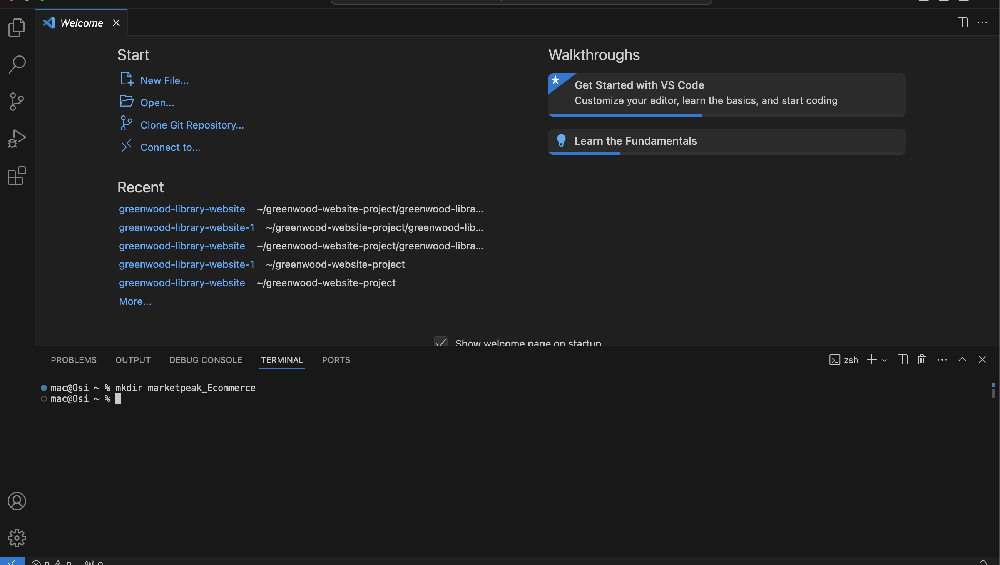

## Marketpeak-Ecommerce
Marketpeak Commerce is a new online market place. This platform features product listings, shopping cart and user authentication and much more.
#### - creation of Market-Ecommerce directory.         
#### - Initialization of git repository.    
#### - Extraction of website template into repository.       
-created and added remote repository to github without initializing it with a readme, gitignore or license.
           

 -Launched EC2 instance with ubuntu web server 

  <ins>CLONING THE REPOSITORY ON LINUX SERVER     
  1. Generated ssh key pair by using "ssh-keygen" command on the server. 
 2. Display,copy and add generated ssh keypair into github account.    
 3. Used SSH clone URL to successfully clone repository on the Linux server. 